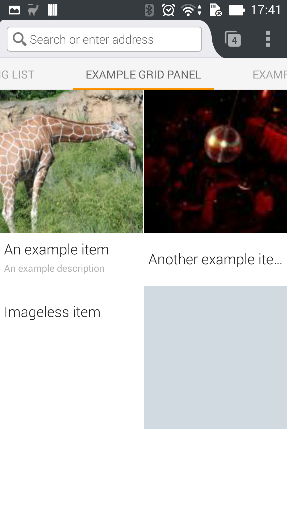
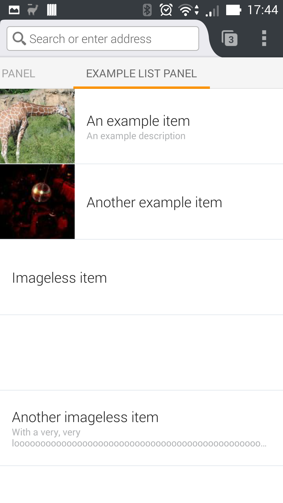
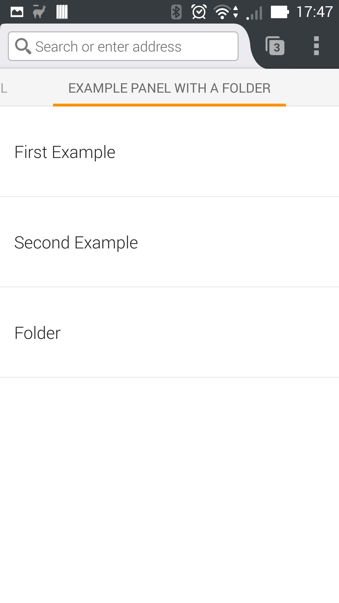
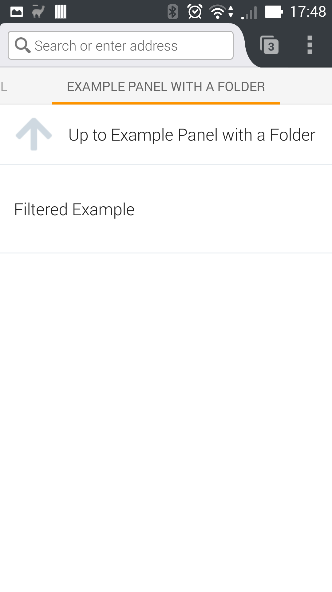

# jetpack-homepanel
[](https://travis-ci.org/freaktechnik/jetpack-homepanel)

Module to add home panels to Firefox for Android with Jetpack.
In the npm registry: https://www.npmjs.com/package/jetpack-homepanel

## License
This project is licensed unter the MPL 2.0. For the full license text, check out [mozilla.org/MPL/2.0/](http://mozilla.org/MPL/2.0/).

## Running Tests
To run the tests, you have to install the jpm-mobile module and then just execute `jpm-mobile test` with the matching arguments.

## Usage
Using this module is as simple as running `npm install jetpack-homepanel --save` and npm will do the rest for you.
### Section
Represents a list or grid of items in a panel on the homescreen. Fennec
currently only supports one per panel.
#### Items
Items for the section follow https://developer.mozilla.org/en-US/Add-ons/Firefox_for_Android/API/HomeProvider.jsm/HomeStorage#Item_attributes. The maximal number of supported items is 100.
#### Constructor
##### Required Options
###### type
Either has the value of `Types.GRID` or `Types.LIST`. `Types.GRID` shows
"thumbnails" like the default panel and `Types.LIST` shows the items in a list,
like the other default panels.
##### Optional Options
###### backImageUrl
An string with a URL poitning to a background image for the panel.
###### empty
Object with a text and imageUrl property, specifying the contents of the panel
when there are no items to display.
###### data
List of items added to the section upon construction.
###### manuallyRefreshable
Boolean indicating, if a user can pull down to refresh the content of the panel.
Defaults to true.
###### onRefresh
Event listener attached to the refresh event.
#### Properties
##### id
(readonly) ID of the section in the HomeStorage.
##### type
The (readonly) type of the section.
##### data
Array of items within the section.
#### Methods
##### addData(newData)
This is a more efficient way of adding items to the section than setting the data
attribute with a concatenated array.
##### setData(newData)
Does the same as setting the data attribute but returns a promise that resolves
whenever the data is acutally replaced.
##### clear()
Removes all items from the section
##### destroy()
Cleans the object's private attributes and clears its items.
##### Event listening methods (on, once etc.)
#### Events
##### refresh
The refresh event can only get fired if manuallyRefreshable was true in the
constructor. It is triggered after the user pulled down to refresh. The loading
animation will only stop, if the data property is set or addData is called.
### HomePanel
#### Constructor
Adds a panel to fennec's homescreen.
##### Required arguments
###### title
The title displayed for the panel on the fennec homepage.
###### sections
An array of at least one Sections. Firefox currently only supports one Section per HomePanel.
##### Optional arguments
###### onInstall
Event listener for the install event.
###### onUninstall
Event listener for the uninstall event.
#### Properties
##### isShowing
Boolean indicating, whether or not the panel is currently accessible on Fennec's
homescreen. Read only.
##### title
The title of the panel.
##### sections
Sections in the panel.
#### Methods
##### show()
Adds the panel to fennec's homescreen. Returns a promise that resolves when the
panel is installed.
##### hide()
Removes the panel from fennec's homescreen. Returns a promise that resolves when
the panel is uninstalled.
##### destroy()
Clears the panel's attributes and sections, which removes the panel from Firefox.
##### Event listening methods (on, once, etc.)
#### Events
##### install
Fired whenever the panel is added to fennec's homescreen.
##### uninstall
Fired whenever the panel is removed from fennec's homescreen.

### Example
#### Grid Panel
```js
const { HomePanel, Section, Types } = require("jetpack-homepanel");

let section = Section({
            type: Types.GRID,
            data: [
                {
                    url: "http://example.com/",
                    title: "An example item",
                    description: "An example description",
                    image_url: "http://lorempixel.com/190/190"
                },
                {
                    url: "http://example.com/",
                    title: "Another example item",
                    image_url: "http://lorempixel.com/95/95"
                },
                {
                    url: "http://just.an/url",
                    title: "Imageless item"
                },
                {
                    url: "http://example.com",
                    image_url: "http://lorempixel/191/191"
                }
            ]
        });

HomePanel({
    title: "Example Grid Panel",
    sections: [
        section
    ]
});
```
The code above results in such a panel:

#### List Panel
```js
const { HomePanel, Section, Types } = require("jetpack-homepanel");

HomePanel({
    title: "Example List Panel",
    sections: [
        Section({
            type: Types.LIST,
            data: [
                {
                    url: "http://example.com/",
                    title: "An example item",
                    description: "An example description",
                    image_url: "http://lorempixel.com/190/190"
                },
                {
                    url: "http://example.com/",
                    title: "Another example item",
                    image_url: "http://lorempixel.com/95/95"
                },
                {
                    url: "http://just.an/url",
                    title: "Imageless item"
                },
                {
                    url: "http://url.with/picture",
                    image_url: "http://lorempixel/190/190"
                },
                {
                    url: "http://example.com",
                    title: "Another imageless item",
                    description: "With a very, very loooooooooooooooooooooooooooooooooooooooooooooooooooooooooooooooooooooooooooooooooooong description"
                }
            ]
        })
    ]
});
```
The code above results in a panel shown in this screenshot:

#### List with a Folder
The item configuration for this example was taken from the [MDN HomeProvider.jsm Example](https://developer.mozilla.org/en-US/Add-ons/Firefox_for_Android/API/HomeProvider.jsm#Example).
```js
const { HomePanel, Section, Types } = require("jetpack-homepanel");

HomePanel({
    title: "Example Panel with a Folder",
    sections: [
        Section({
            type: Types.LIST,
            data: [
                { url: "http://example.com/first",
                  title: "First Example" },
                { url: "http://example.com/second",
                  title: "Second Example" },
                { url: "filter://folder",
                  title: "Folder" },
                { url: "http://example.com/third",
                  title: "Filtered Example",
                  filter: "folder" }
            ]
        })
    ]
});
```
The code above results in a panel like the following screenshots show:

