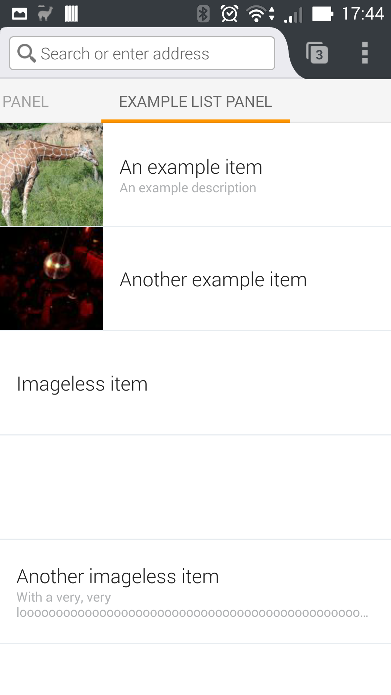
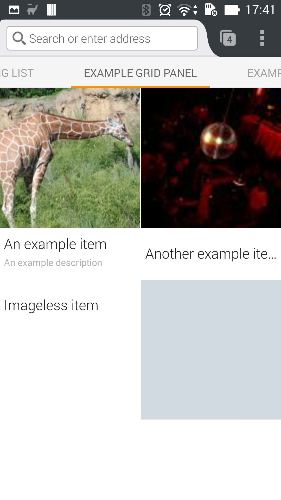

# jetpack-homepanel Walkthough
This is the equivalent to the [MDN Firefox Hub Walkthrough Guide](https://developer.mozilla.org/en-US/Add-ons/Firefox_for_Android/Firefox_Hub_Walkthrough) for the `jetpack-homepanel` module.

## Storing data
Before you can create your panel, you need to define its initial contents. This is done by creating a [Section](/README.md#section) object. In theory a panel could have multiple sections, but Firefox for Android currently only supports one section per panel.

The Section manages and stores the data displayed in your panel. The data is stored asynchronously, which causes all explicit methods for storing data to return a Promise. By default the section can be refreshed by pulling down. The refresh animation stops, as soon as you update or add data to the section.

```js
const { Section, Types } = require("jetpack-homepanel");

var items = {
    { url: "http://example.com/1", title: "Example 1" },
    { url: "http://example.com/2", title: "Example 2" }
];

var section = new Section({
    type: Types.LIST,
    data: items,
    onRefresh: function() {
        // do data update
    }
});
```

See the documentation of the [Section Object](/README.md#section) for a full reference of all constructor options.

In practice, if you are going to use a network request to fetch your data, you should use the `requestSync` method to allow Firefox to decide, if it's a good time to sync.
```js
section.requestSync().then(() => {
    // Fetch new data and store it in the section.
});
```

You can also set the `refreshInterval` property to sync data in a refular interval.
```js
section.refreshInterval = 3600;

// This gets called once every hour now, unless the user manually refreshes the view
section.on("refresh", () => {
    // Fetch new data and store it in the section
});
```

## Creating a home panel
After you have created your section, you have to display it in a panel of the Firefox for Android homescreen.
To create a panel, create a new [HomePanel](/README.md#homepanel) object. It mainly consists of a title that is used to identify the panel and the section the panel contains.

This example assumes, that you have created a section and saved it in the `section` variable.
```js
const { HomePanel } = require("jetpack-homepanel");

var panel = new HomePanel({
    title: "My Panel",
    sections: [ section ]
});
```

## View types
Each view you create can have one of three different layouts: *list*, *grid* or *speed dial*.

### List
The list view displays items in a list, from top to bottom:


To create a list view, specify the section's `type` as `LIST`:
```js
const { Section, Types } = require("jetpack-homepanel");

var section = new Section({
    type: Types.LIST,
    data: items
});
```

#### List item data
For each item, the list view will display the following attributes, if they are present:

 - `title`
 - `description`
 - the image referenced by `image_url`

You must supply at least one of these attributes for each item.

### Grid
The grid view displays items in a grid, as images:


To create a grid view, specify the section's `type` as `GRID`:
```js
const { Section, Types } = require("jetpack-homepanel");

var section = new Section({
    type: Types.GRID,
    data: items
});
```

#### Grid item data
For each item, the grid view will display the following attributes, if they are present:

 - `title`
 - `description`
 - the image referenced by `image_url`

The frid view is primarily designed to display the image referenced by `image_url`.

You must supply at least one of these attributes for each item.

### Speed dial
Starting in Firefox 41, there's a special type of grid view, called speed dial. In this view each item is presented as a background image or background color, and optionally a title or an icon.

To create a speed dial view, specify `GRID` as the section's `type` and `ICON` as the `itemType`.
```js
const { Section, Types, ItemTypes } = require("jetpack-homepanel");

var section = new Section({
    type: Types.GRID,
    itemType: ItemTypes.ICON,
    data: items
});
```

#### Speed dial item data
For each item, the speed dial view will display the following attributes, if they are present:
 - `background_color`
 - the image referenced by `background_url`, as a background image
 - the image referenced by `image_url`, as an icon
 - `title`

You must supply at least one of `title` or `image_url` for each item.

### Headers
From Firefox 42 onwards, you can specify a header image for a grid view using the `header` attribute of a section:
```js
const { Section, Types, ItemTypes } = require("jetpack-homepanel");

var section = new Section({
    type: Types.GRID,
    itemType: ItemTypes.ICON,
    header: {
        image_url: "http://path/to/pumpkin.png",
        url: "http://www.mozilla.org"
    },
    data: items
});
```

Header images are placed at the top of the page and extend right across the page.

### Empty view
You can specify an image and a description to display while there is no data in your section:
```js
const self = require("sdk/self");
const { Section, Types } = require("jetpack-homepanel");

var section = new Section({
    type: Types.LIST,
    empty: {
        text: "No data to display",
        imageUrl: self.data.url("empty.png")
    },
    data: items
});
```

You don't have to give both a text and an image. If not set, Firefox will show a default empty view. The image is displayed in a 90dp square (that's 90px on mdpi devices, 180px on xhdpi devices).

## What's not quite possible yet
 - Authentification
